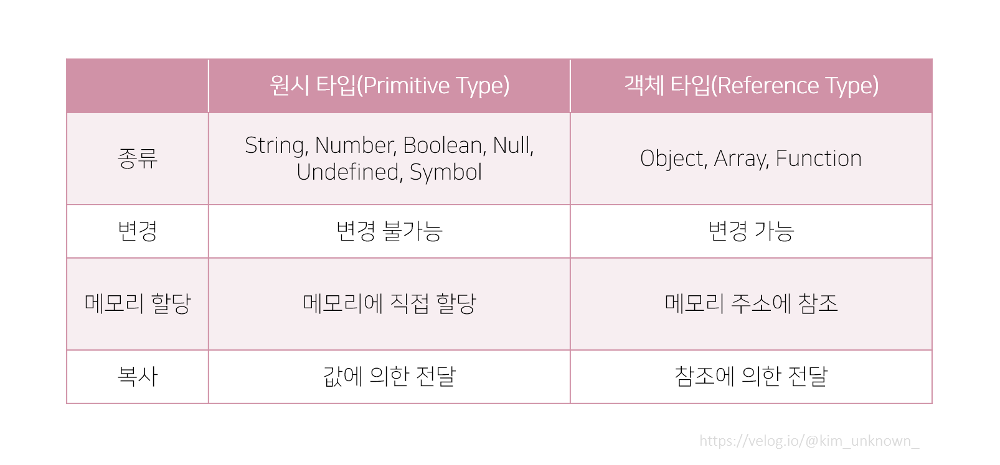

## 원시값과 참조값,  얕은비교와 깊은비교


오늘 리펙토링 하다가 겪은 거였다. 

대충 소스로 쓰면


````javascript

const main = useRecoilValue(mainData) => {a:'a', b: 'b'}

const sub = useRecoilValue(subValue) => [{a:'a', b: 'b'}... ]


const params = {
    ...main,
    subValue : sub
}

http.post('대충 http~~' , params)


````

해당 params가 post 요청을 보내기 전에 param 를 보내는 모든 오브젝트의 키값을 찾아 빈값을 삭제해주는 유틸 함수를 하나 타는데, 
거기에 params 에 sub 에 있는 오브젝트가 참조 되면서 상태관리 되고 있는 값을 직접 수정하려는 짓을 해버리고 만것...

여기서 알아볼것은 위처럼 params 를 만들면서 스프레드 연산자를 사용할때 "복사" 되는것과 "참조"  되는것이 다르기 때문이다.



예시를 한번 보자 

````javascript
const data = {
  id: '1',
  name: 'name',
  code: {
    codeNumber: '1',
  },
};

const copiedData = { ...data };

//     id: '1', 
//     name: 'name',

// 는 깊은복사 즉 실제 복사 된 상태이지만
// code: {
//     codeNumber: '1',
// },
//
// 이 code 라는 오브젝트는 data.code 를 참조하고 있는것이기 때문에,
//     copiedData.code.codeNumber = '2'
//
// 이걸 해버리면 data.code.codeNumber 또한 같이 2로 바뀌고 만다.
````

위 이미지와 같이 해당 객체에 1차원으로 있는 일반값 즉 원시타입은 스프레드 연산자를 통해서 복사를 하면 진짜로 복사가 되지만, 

객체나 배열, 함수등은 복사가 되는게 아니라 참조가 됨으로,  

이런 객체 타입 데이터가 포함된 오브젝트를 복사해서 수정하려고 할땐 꼭 "깊은복사 해서 가져가자"


두번째

우선 소스를 보자 

````javascript
const setManagerData = useSetRecoilState(ManagerData)


         const newUnqNo = response?.data?.data?.partnMngrUnqNo;

         // 1번방법
          setManagerData((currVal) =>
            currVal.map((item) =>
              item.partnMngrUnqNo === unqNo
                ? {...item, partnMngrUnqNo: newUnqNo,} : item,
            ),
          );
          
          // 2번방법 (오류)
           setManagerData((currVal) => {
             currVal.map((item: IPartnerManagerDatas) => {
               if (item.partnMngrUnqNo === unqNo) {
                 item.partnMngrUnqNo = newUnqNo;
               }
             });
          
             return currVal;
           });
````

상태관리를 잘못 이해하고 사용했다
2번 방법에서 currVal 를 순회하면서  

````javascript
if (item.partnMngrUnqNo === unqNo) {
item.partnMngrUnqNo = newUnqNo;
}
````
를 했는데,
item.partnMngrUnqNo = newUnqNo; 이게 된순간 currVal 가 참조하는 내부에 managerData 의 값은 새로운 값으로 바뀌었으나, 

return currVal; 이걸 그대로 리턴 해주었으니, 

참조하는 값이 달라지지 않아서 상태가 변경되지 않았다고 판단되었고 리렌더링이 이루어지지 않은 것이였다. 

1번 같은 경우에는,  ? {...item, partnMngrUnqNo: newUnqNo,} : item, 이렇게 새로운 객체가 생성되어서 set 이 되었기 때문에 확실히 바뀐 값으로 상태가 변경되는 것이다. 

````javascript

setManagerData((currVal) => {
  const data = deepCopy(currVal);

  data.map((item: IPartnerManagerDatas) => {
    if (item.partnMngrUnqNo === unqNo) {
      item.partnMngrUnqNo = newUnqNo;  // 객체 직접 변경
    }
  });

  return data;  // 기존 배열을 그대로 반환
});
````

뭐 이런식으로 쓰는 방법도 있겠지만..  굳이 쓸때없이 모든 객체를 깊은복사 때려서 그걸 또 바꾸는 비효율적인 짓은 안하는게 좋겠다. 
첫번째 방법처럼 딱 필요한 객체만 변경해주고 나머지는 그대로 넣어주면 되니까 
