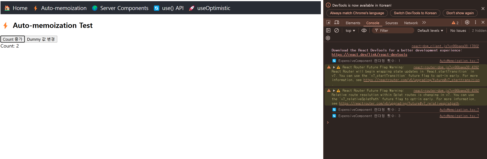
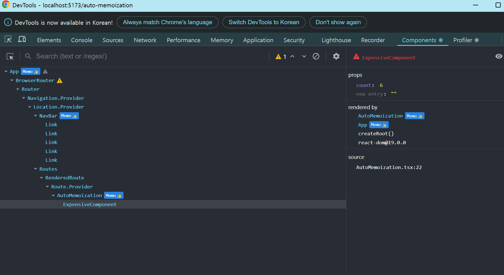

## React19 알아보기1 - React Compiler

https://ko.react.dev/learn/react-compiler 

React19 에서는 실험적으로 React Compiler 가 불필요한 렌더링을 발생시키지 않게끔 한다. 





저런식으로 React Compiler 가 메모리제이션 한 컴포넌트는 옆에 Memo 태그가 붙는다고 한다. 

````javascript
import {useState} from "react";

let renderCount = 0;

const ExpensiveComponent = ({ count }: { count: number }) => {
    renderCount++;
    console.log(`🔄 ExpensiveComponent 렌더링 횟수: ${renderCount}`);

    return <div>Count: {count}</div>;
};

const AutoMemoization = () => {

    const [count, setCount] = useState(0);
    const [dummy, setDummy] = useState(0);

    return (
        <div>
            <h2>⚡ Auto-memoization Test</h2>
            <button onClick={() => setCount((c) => c + 1)}>Count 증가</button>
            <button onClick={() => setDummy((d) => d + 1)}>Dummy 값 변경</button>

            <ExpensiveComponent count={count} />
        </div>
    );

}

export default AutoMemoization
````

아래 소스의 경우 Dummy 값 변경 을 아무리 눌러도 react 19 에서는 로그에 렌더링 횟수로 체크되지 않는다. 


````javascript
const ExpensiveComponent = mamo(({ count }: { count: number }) => {
    renderCount++;
    console.log(`🔄 ExpensiveComponent 렌더링 횟수: ${renderCount}`);

    return <div>Count: {count}</div>;
});

````

이렇게 memo 로 감싼것과 동일한 현상이 발생한다. 

난 vite 에서 테스트 했는데, 

설치해보는 방법은 다음과 같다. 


````javascript
npm install babel-plugin-react-compiler@beta

// vite.config.js
const ReactCompilerConfig = { /* ... */ };

export default defineConfig(() => {
    return {
        plugins: [
            react({
                babel: {
                    plugins: [
                        ["babel-plugin-react-compiler", ReactCompilerConfig],
                    ],
                },
            }),
        ],
        // ...
    };
});


npm install -D eslint-plugin-react-compiler@beta

import reactCompiler from 'eslint-plugin-react-compiler'

export default [
    {
        plugins: {
            'react-compiler': reactCompiler,
        },
        rules: {
            'react-compiler/react-compiler': 'error',
        },
    },
]


````

