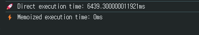

## Memoization 할때 안할때 구별하기 

react 훅에는 useMemo 나 useCallBack 과 같이 Memoization 함수가 있다. 

해당 훅들은 useEffect 의 사용법과 같이 의존성 배열에 있는 값이 변경될때마다, 

useMemo 의 경우 값을 계산하여 변수에 저장하고, useCallBack 의 경우 함수를 실행하게 된다. 

특히 useMemo 의 경우 어떤 복잡한 계산 결과를 요하는 (반복문 등) 경우 렌더링 시마다 해당 값을 계속 계산하게 되면, 

성능낭비가 발생하기 때문에,  특정 값이 변할때만 즉 해당 값을 계산할 필요가 있을 때만 사용하게 하여 성능을 개선시킬 수 있게된다. 

다 좋아보이지만,  또 무작정 사용하면 안되는 것이 Memoization 이다. 

우선 Memoization 이 어떤 원리로 동작하는지 알아보자 

#### 오버헤드 
    
    Memoization 은 동일한 계산을 반복해야 할때 이전에 계산했던 값들을 메모리에 저장 함으로써,
    동일한 계산의 반복 수행을 제거하여, 프로그램 실행 속도롤 빠르게 할 수 있는 방법이다. 
    자바스크립트 엔진이 가비지 컬렉션을 수행하는 시점까지 메모리를 유지한다. 

#### 의존성 배열
    의존성 배열(dependency array)은 특정 값들의 변화를 감지하여 Hook의 동작을 제어하는 역할을 한다. 
    deps 가 객체라면 앝은비교로 체크함으로, 새로운 객체라면 재계산된다. 


즉 Memoization 하는 경우 해당 값을 저장하기 위해 메모리를 사용하며, 

의존성 배열의 값이 변경될때 만 작동하기 때문에 의도치 않게 오래된 값이 남아있을 수 있다. 

또한 Memoization 를 위한 비용도 발생하기 마련이다. 


### 그럼 언제 쓰면 좋을까?

1. 반복문이 사용되는 경우 (O(n)
```javascript
const sortedItems = useMemo(() => items.sort((a, b) => a.value - b.value), [items]);
```

2. 객체/배열 참조 유지가 중요한 경우

````javascript
const memoizedOptions = useMemo(() => [{ id: 1, label: 'Option A' }], []);
````

반대의 경우라면 사용하지 않는게 좋다.

그렇다면 여기서 궁금한 부분

어느정도면 Memoization 을 사용할 법 할까?

실제 비용을 계산해보았다. 


````javascript
import { useMemo, useState } from "react";

const expensiveCalculation = (num: number) => {
    let result = 0;
    for (let i = 0; i < 1_000_000; i++) {   // 100 일때와 비교 
        result += num * i;
    }
    return result;
};

const MemoTest = () => {
    const [count, setCount] = useState(0);
    const [otherState, setOtherState] = useState(0);

    // 직접 실행
    const start1 = performance.now();
    const directResult = expensiveCalculation(count);
    const end1 = performance.now();
    console.log(`🚀 Direct execution time: ${end1 - start1}ms`);

    // useMemo 적용
    const start2 = performance.now();
    const memoizedResult = useMemo(() => expensiveCalculation(count), [count]);
    const end2 = performance.now();
    console.log(`⚡ Memoized execution time: ${end2 - start2}ms`);

    return (
        <div>
            <h1>Direct: {directResult}</h1>
            <h1>Memoized: {memoizedResult}</h1>
            <button onClick={() => setCount((prev) => prev + 1)}>Increase</button>
            <button onClick={() => setOtherState((prev) => prev + 1)}>Update Other State</button>
        </div>
    );
};

export default MemoTest;


````

실제로 100 이나 1000 정도로는 유의미한 시간차가 없었다.  

하지만 반복문이 많이 수행되거나, 정말 렌더링이 잦은경우는 꽤 차이가 컸다  

100만번 반복했을때,



랜더링이 잦았을때, (Update Other State) 를 많이 클릭했을때도 화면상 지연이 뚜렷하게 나타났다.